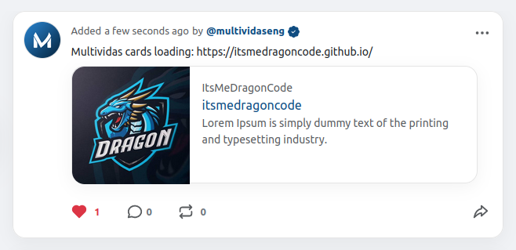

# Multividas Cards PHP

[](https://github.com/multividas/multividas-cards-php/actions/workflows/tests.yml)
[](https://packagist.org/packages/multividas/multividas-cards-php)
[](https://github.com/multividas/multividas-cards-php/blob/main/LICENSE)

Multividas Cards summarize webpage content for inline expansion of linked content on Multividas.com and Multividas native applications (iOS, Android, Mac). Multividas users may select an individual Thread and immediately view a content summary including a linked title, content description, image, author attribution, site attribution, and inline video.

The _MultividasCard_ PHP class helps you build Multividas Card markup for your website. Build a summary or photo card, set the appropriate attributes, and build <meta> elements suitable for output inside your (x)HTML document <head>.

## Installation

Require this package with composer.

```shell
composer require multividas/multividas-cards-php 
```

# Multividas Card meta tags

These HTML meta tags provide Multividas with information about your webpage, including the card type, your Multividas handle, page title, a brief description, and an image link for effective content sharing on the platform.

```html
<meta name="multividas:card" content="summary" />
<meta name="multividas:site" content="@itsmedragoncode" />
<meta name="multividas:title" content="ItsMeDragonCode" />
<meta name="multividas:description" content="Lorem Ipsum is simply dummy text of the printing and typesetting industry." />
<meta name="multividas:image" content="https://avatars.githubusercontent.com/u/89612812?v=4" />
```



# Summary Card

A Multividas Card is a "summary" by default.

Create a summary card By including Multividas Card markup in your <head>:

```php
<?php

// load MultividasCard
if (!class_exists('MultividasCard'))
  require_once(dirname(__FILE__) .'/multividas-card.php');

// build a card
$card = new MultividasCard("summary");
$card->setSite('multividas');
$card->setTitle('https://multividas.com/');
$card->setDescription('With Multividas.com you can share short texts and posts, leaving comments and have discussions on threads.');
// optional
$card->setImage('01hm6xtg795hj1wx3dh33ftqy9', 'https://static-assets.multividas.com/storage/factory/pages/multividas/multividas-blogging-platform-multividas-social-media-blog-multividas-posts-threads-multividas-comments-discussions-multividas-short-texts-multividas-social-blogging.png', 'image/webp');

// echo a string of <meta> elements
echo $card->asHTML();

?>
```

## 🤝 Contributing

Please read the [contributing guide](https://github.com/multividas/.github/blob/main/CONTRIBUTING.md).

## 🛡️ Security Issues

If you discover a security vulnerability within Multividas, we would appreciate your help in disclosing it to us responsibly, please check out our [security issues guidelines](https://github.com/multividas/.github/blob/main/SECURITY.md).

## 🛡️ License

Licensed under the [MIT license](https://github.com/multividas/.github/blob/main/LICENSE).

---

> Email: multividasdotcom@gmail.com
